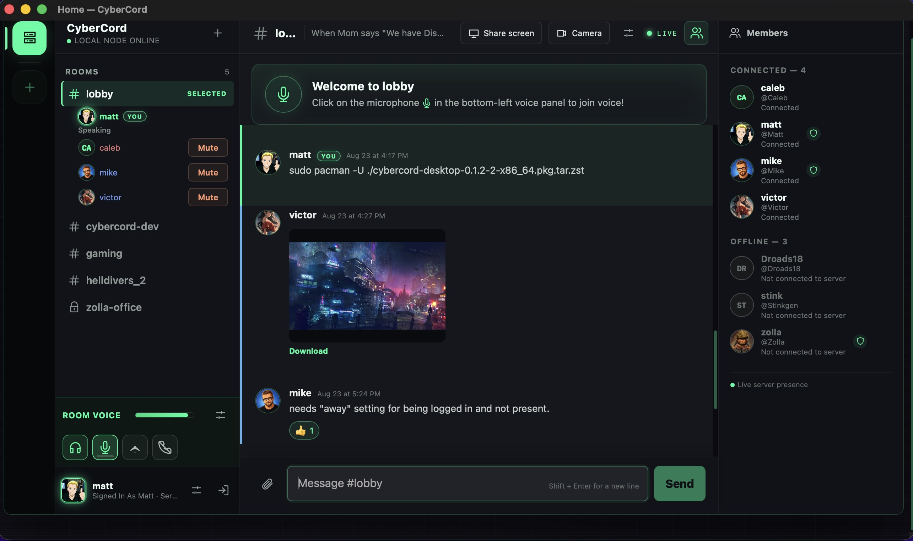
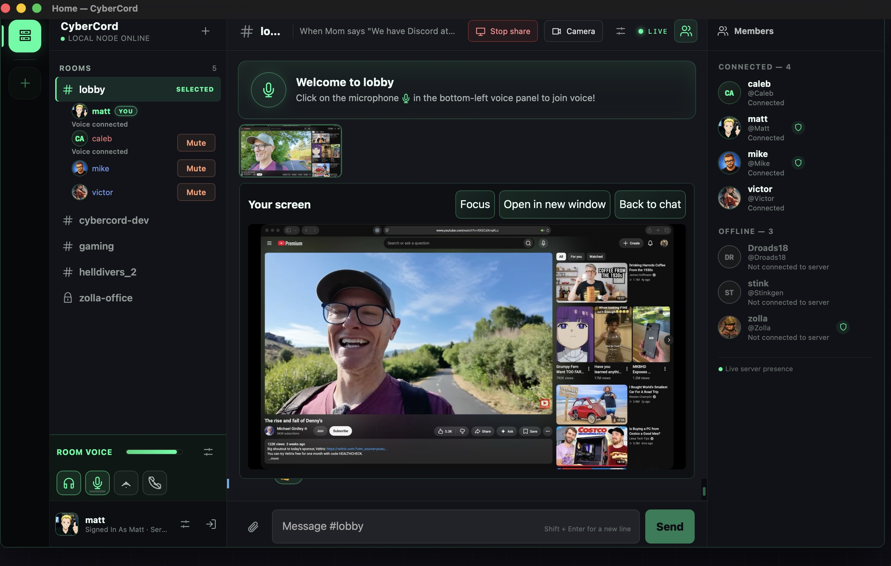
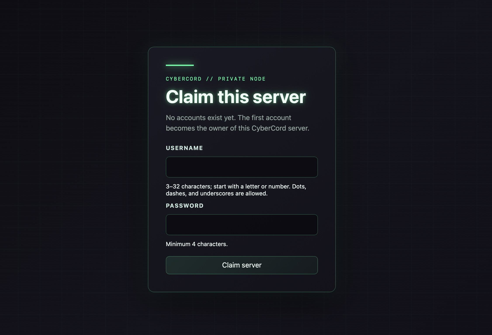
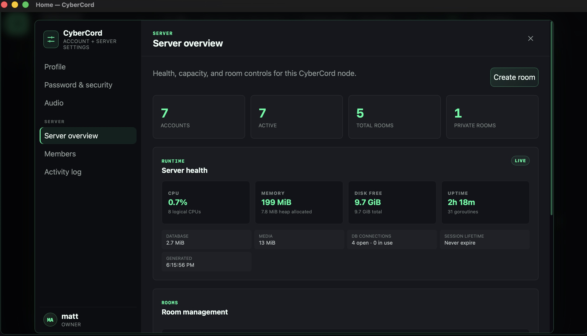
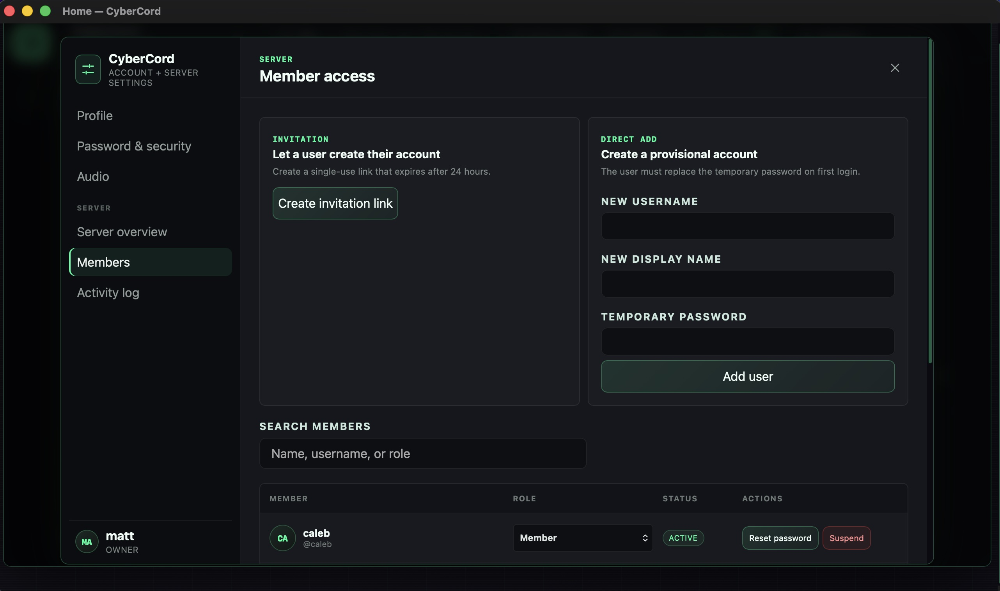
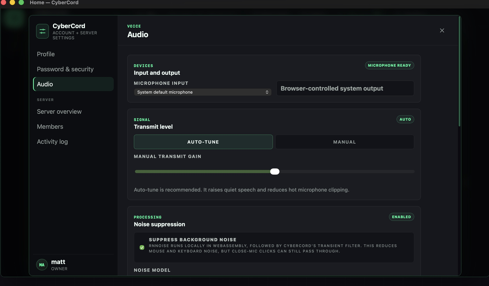
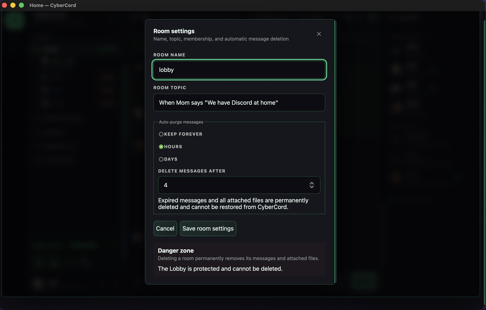

# CyberCord

> A privacy-first 🧐, secure 🔒, local 🧑‍💻 chat / voice / video social platform.
> Tiny. Private. Yours.

<p align="center">
  <a href="https://github.com/RamboRogers/cybercordnow/releases/latest"></a>
  <a href="https://github.com/RamboRogers/cybercordnow/releases"></a>
  <a href="https://github.com/RamboRogers/cybercordnow/stargazers"></a>
  <a href="https://github.com/RamboRogers/cybercordnow/pkgs/container/cybercord-server"></a>
  <a href="LICENSE"></a>
</p>

<!-- Hero: main workspace — chat, voice, members -->
<p align="center">
  
</p>

CyberCord is a self-hosted room platform that runs in **a single container from a single self-contained binary**. `docker run` it, open the URL, claim it — that's the whole setup. It serves its own interface to desktop and mobile browsers, offers optional native desktop clients, and carries text, files, voice, and video through **one HTTPS endpoint**.

It's also a poke in the eye 👁️ to everyone who wants to record you, your kids, or your friends. Conversations can dissolve on a timer, screen shares are never persisted, and server-side state stays on hardware you control.

---

## ✦ Why CyberCord

| | |
|---|---|
| 🧐 **Privacy first** | Dissolving chats delete themselves after hours or days — old conversations stop existing instead of leaking later |
| 🔒 **Secure** | Argon2id passwords, opaque sessions, CSRF protection, flood control, invite-only by default |
| 🧑‍💻 **Local** | Your server, your hardware, your data. No cloud, no telemetry, no account somewhere else |
| 📦 **Tiny** | One container, one self-contained Go binary, embedded browser UI — pure-Go SQLite, no external database |
| 🔌 **One endpoint** | One HTTPS endpoint carries text, files, voice, video, and screen share through Caddy or another WebSocket-capable reverse proxy |
| 🖥️ **Easy to use** | Built-in desktop/mobile browser interface; optional native desktop clients point at your server |

## ✦ Key Features

- **Rooms with multiple webcams and desktop streaming users at once**
- **Text chat with rich media support** — video, files, images — and emoji reactions
- **Rooms with privacy settings** — public or private with explicit membership lists
- **Dissolving chat** — auto-delete messages after X hours or days, attachments included
- **Real room voice** — mix-minus server mixing, noise suppression, echo cancellation
- **One HTTPS endpoint for all app traffic** — text, files, voice, video, and screen share

<p align="center">
  
</p>

## ⚡️ Coming Soon

- **Federation** — cross-server room federation, federated chat, and shared media 💿
- **Polish** — ongoing bug fixes and performance improvements. [Open an issue](https://github.com/RamboRogers/cybercordnow/issues) if you find something. ❤️

---

## ✦ Setting up a Server

CyberCord is one container and one persistent data volume. Use the direct command for a local test, or the included Compose stack for a public home server with automatic HTTPS.

### One-line Compose quickstart

Install Docker Engine with Compose v2, point a DNS name at the server, and replace the domain and email in this command:

```bash
curl --proto '=https' --proto-redir '=https' --tlsv1.2 -fsSL https://raw.githubusercontent.com/RamboRogers/cybercordnow/main/install.sh | bash -s -- chat.example.com owner@example.com
```

The installer creates `~/cybercord`, downloads the reviewed Compose and Caddy files, writes a private `.env`, validates the stack, pulls the images, and starts it. Rerunning the command refreshes the deployment files without replacing an existing `.env` or data volume.

If you prefer to inspect scripts before running them, download [`install.sh`](install.sh), review it, and run `bash install.sh chat.example.com owner@example.com`.

### Quick local test

```bash
docker run -d \
  --name cybercord \
  -p 127.0.0.1:8080:8080 \
  -v cybercord-data:/var/lib/cybercord \
  ghcr.io/ramborogers/cybercord-server:0.1.3
```

1. Open <http://localhost:8080>.
2. **Claim the server** — the first account created becomes the owner.
3. Stop it later with `docker stop cybercord`.

The localhost binding is deliberately not public. Browser microphone, camera, and screen capture work on browser-recognized localhost, but a remotely accessible server needs HTTPS.

### Public home server with Caddy

The included [`compose.yaml`](compose.yaml) runs CyberCord behind [Caddy](https://caddyserver.com/). Caddy obtains and renews a public TLS certificate, redirects HTTP to HTTPS, and proxies CyberCord's HTTP and WebSocket traffic. CyberCord's internal port `8080` is **not** published to your network or the internet.

The current server image targets Linux x86-64 (`linux/amd64`). It runs natively on standard Intel/AMD Linux hosts and through Docker Desktop's built-in emulation on Apple Silicon Macs.

#### 1. Point a domain at your home

Create a DNS `A` record such as `chat.example.com` pointing to your home's public IPv4 address. Add an `AAAA` record only if your Docker host has working public IPv6. If your address changes, configure dynamic DNS with your DNS provider or router.

#### 2. Forward the edge ports

Reserve a stable LAN address for the Docker host, then add these router/NAT rules:

| Internet/WAN | Docker host | Protocol | Required? |
|---|---|---|---|
| `80` | `80` | TCP | Yes — HTTPS certificate issuance/renewal and HTTP redirect |
| `443` | `443` | TCP | Yes — CyberCord HTTPS, WebSockets, voice, video, and screen sharing |
| `443` | `443` | UDP | Optional — HTTP/3 |

Allow the same ports through the host firewall. **Do not forward port `8080`;** it is only the private Caddy-to-CyberCord connection inside Docker.

If your ISP uses carrier-grade NAT (CGNAT), blocks inbound ports, or does not give your router a public address, ordinary port forwarding cannot work. Use a TCP-capable tunnel, public reverse proxy, or VPN instead.

#### 3. Configure the stack

```bash
git clone https://github.com/RamboRogers/cybercordnow.git
cd cybercordnow
cp .env.example .env
```

Edit `.env` and set at least:

```dotenv
CYBERCORD_DOMAIN=chat.example.com
ACME_EMAIL=you@example.com
CYBERCORD_IMAGE=ghcr.io/ramborogers/cybercord-server:0.1.3
```

The internal-network values normally need no changes. If Docker reports an overlapping address pool, choose another private `/24` subnet and keep both internal IPs inside it and distinct from each other.

#### 4. Start CyberCord

```bash
docker compose config
docker compose pull
docker compose up -d
docker compose ps
```

Caddy requests the certificate automatically. Follow startup if needed:

```bash
docker compose logs -f caddy cybercord
```

#### 5. Verify and claim it

```bash
curl -fsS https://chat.example.com/healthz
curl -fsS https://chat.example.com/readyz
```

Both commands should return an `ok`/`ready` JSON response. Open `https://chat.example.com`, create the first account to claim the server, and then create single-use invitations for everyone else. Test from a phone with Wi-Fi disabled if your router does not support NAT loopback.

<p align="center">
  
</p>

### Updating and operating

To upgrade, change `CYBERCORD_IMAGE` in `.env` to the desired release, then run:

```bash
docker compose pull
docker compose up -d
```

The versioned `ghcr.io/ramborogers/cybercord-server:0.1.3` tag is recommended for repeatable deployments. `ghcr.io/ramborogers/cybercord-server:latest` tracks the newest public server release.

View status and logs with `docker compose ps` and `docker compose logs`. `docker compose down` removes the containers and networks but preserves the named data and certificate volumes. **Do not run `docker compose down -v` unless you intend to delete the CyberCord database and Caddy's TLS state.**

The server keeps its state in one SQLite data directory (`/var/lib/cybercord` in the container) — back that up and you've backed up everything.

<p align="center">
  
</p>

### Configuration (all optional)

| Variable | Default | Purpose |
|---|---|---|
| `CYBERCORD_HTTP_ADDRESS` | `0.0.0.0:8080` | HTTP listen address |
| `CYBERCORD_DATA_DIR` | `/var/lib/cybercord` | SQLite + mutable state |
| `CYBERCORD_REGISTRATION_MODE` | `invite` | `closed` / `invite` / `open` |
| `CYBERCORD_SESSION_TTL` | `never` | Session lifetime (max 30d) |
| `CYBERCORD_SECURE_COOKIES` | `false` | HTTPS-only session cookie; the Compose stack sets this to `true` |
| `CYBERCORD_TRUSTED_PROXY_CIDRS` | empty | Proxies allowed to supply client addresses; Compose trusts only its fixed Caddy address |

## ✦ Using your Server

**Inviting people:** send them an invite link. They click it, provide credentials, and they're in. That's it. Links are single-use and expire after 24 hours; owners can also create provisional accounts directly and revoke, suspend, or re-enroll anyone from the same page.

<p align="center">
  
</p>

Everyday use happens in **rooms**:

- Click into a room, hit the microphone, and you're in voice — speaking rings show who's talking, including you.
- Share your screen or camera; multiple people can stream at once. Shares are live-only: never recorded, never persisted.
- Drop videos, files, and images straight into chat; react with emoji.
- Tune your mic with built-in noise suppression and echo cancellation.

<p align="center">
  
  
</p>

<br clear="all">

**Privacy controls are room-level:** set a room to dissolve its messages after any number of hours or days — expired messages *and their attachments* are permanently deleted. Screen content relayed to a room stays ephemeral forever.

## ✦ Optional Client Binaries

The browser interface is all you need — but native desktop clients add a server manager and OS-keychain credential vault with auto-login. Point one at any CyberCord server, yours or a friend's.

| Platform | Download | Notes |
|---|---|---|
| macOS (Apple Silicon) | [DMG](https://github.com/RamboRogers/cybercordnow/releases/download/v0.1.2/CyberCord-Desktop-macOS-Apple-Silicon.dmg) · [ZIP](https://github.com/RamboRogers/cybercordnow/releases/download/v0.1.2/CyberCord-Desktop-macOS-Apple-Silicon.zip) | Developer ID signed and notarized |
| Windows x64 | [Setup EXE](https://github.com/RamboRogers/cybercordnow/releases/download/v0.1.2/CyberCord-Desktop-Windows-x64-setup.exe) · [MSI](https://github.com/RamboRogers/cybercordnow/releases/download/v0.1.2/CyberCord-Desktop-Windows-x64.msi) | Windows installers |
| Debian / Ubuntu (amd64) | [DEB](https://github.com/RamboRogers/cybercordnow/releases/download/v0.1.2/CyberCord-Desktop-Debian-amd64.deb) | Native Debian package |
| Arch Linux (x86_64) | [PKG.TAR.ZST](https://github.com/RamboRogers/cybercordnow/releases/download/v0.1.2/CyberCord-Desktop-Arch-x86_64.pkg.tar.zst) | Native pacman package |

Current server release: [`v0.1.3`](https://github.com/RamboRogers/cybercordnow/releases/tag/v0.1.3) · Current desktop release: [`v0.1.2`](https://github.com/RamboRogers/cybercordnow/releases/tag/v0.1.2) · [Desktop SHA-256 checksums](https://github.com/RamboRogers/cybercordnow/releases/download/v0.1.2/SHA256SUMS.txt)

First launch: **Servers → Add Server…**, enter your server URL, Connect.

## ✦ License

Released under the [MIT License](LICENSE) — free to use, modify, and distribute, at your own risk. No warranties and no liability.

Built and maintained by [Matthew Rogers (@matthewrogers)](https://x.com/matthewrogers).
